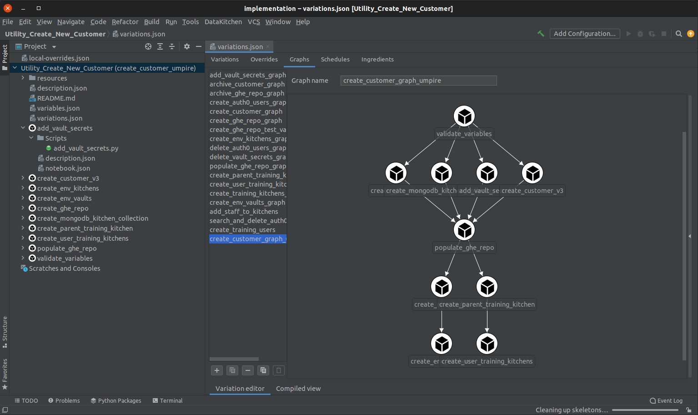

# DKIDE - An IntelliJ plugin for working with DataKitchen's Platform Recipes.

## Requirements
- IntelliJ 2021.2.1
- Docker
- Python >= 3.8
- DKCloudCommand (pip3 install DKCloudCommand)
- Python Community Edition Plugin
- gradle
- Java 11

## Building

Run gradlew buildPlugin
